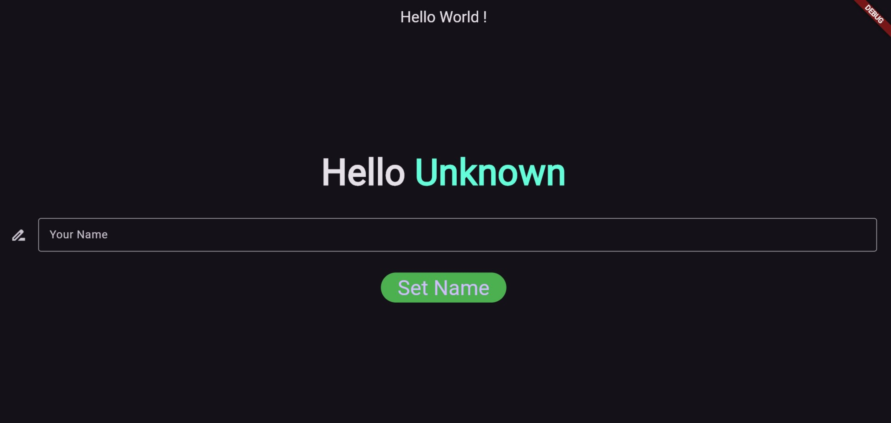
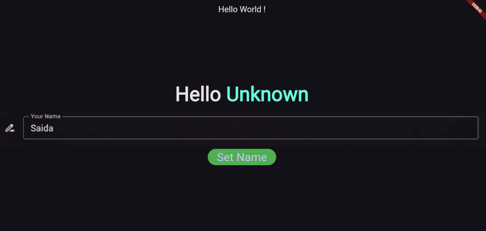
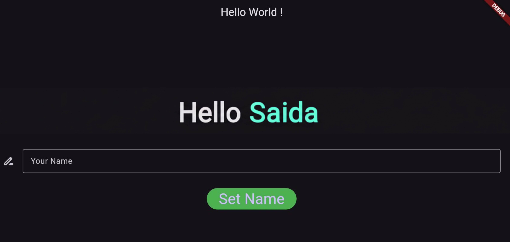

# DApp Flutter + Ethereum — Name Storage

Cette mini-application montre comment intégrer Flutter avec un smart contract Ethereum pour lire et modifier un nom stocké sur une blockchain locale (Ganache).  
Elle illustre une interaction Web3 simple dans un environnement Flutter.

---

## Aperçu de l’application

|-------|--------|--------------|
|  |  |  |
| Nom initial | Entrée utilisateur | Nom mis à jour dans la blockchain |

---
## Fonctionnalités

- Lecture du nom depuis un smart contract Solidity  
- Mise à jour via transaction signée  
- Interface Flutter simple (champ + bouton)  
- Connexion Web3 via `web3dart`  
- Fonctionne avec Ganache (RPC local)

##  Architecture

```
Flutter UI
│
▼
Provider (ContractLinking)
│
▼
Web3Client (web3dart)
│
▼
Smart Contract (Solidity)
│
▼
Ganache

```

### Prérequis

- Flutter 3.x  
- Ganache Desktop  
- Node.js 16+  
- Truffle CLI  
- Chrome, Windows ou Android

### Installation des Dépendances

```bash
# 1. Installer Truffle globalement
npm install -g truffle

# 2. Installer les dépendances Flutter
flutter pub get

# 3. Démarrer Ganache (interface graphique)
# Téléchargeable sur: https://www.trufflesuite.com/ganache
```

### Déploiement du Contrat Intelligent

```bash
# Compiler les contrats
truffle compile

# Déployer sur Ganache
truffle migrate

# Tester le contrat
truffle test
```

### Configuration de l'Application

1. **Ouvrir Ganache** 
2. **Relever :** 
   - RPC Server: `http://localhost:7545`
   - Chain ID: `5777`

3. **Copier la clé privée dpuis Ganache** 

4. **Modifier `contract_linking.dart`** :
```dart
final String _privateKey = "0xREMPLACER_ICI";
```

### Lancement de l'Application

```bash
flutter run -d chrome
flutter run -d windows
flutter run -d android
```

## 🔧 Technologies Utilisées

| Outil    | Rôle               |
| -------- | ------------------ |
| Flutter  | Interface          |
| Dart     | Logique interne    |
| Solidity | Smart contract     |
| Truffle  | Déploiement        |
| Ganache  | Blockchain locale  |
| web3dart | Communication Web3 |
| Provider | Gestion d’état     |


## Flux de fonctionnement

**Lecture :**

App → Web3 → Contrat → Nom affiché

**Écriture :**

App → Transaction → Ganache → Contrat mis à jour → UI rafraîchie


<div align="center">
  <p>Saida Benaissa - ADIA </p>
  <p>Projet académique - Université d'Agadir</p>
</div>
```
